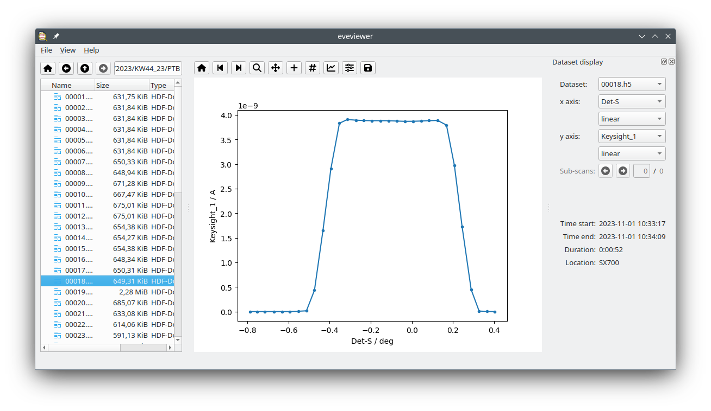

=========
eveviewer
=========

*A GUI for inspecting data contained in EVE files.*

Welcome! This is the documentation for eveviewer, a Python package for graphically inspecting data contained in EVE files, *i.e.* data obtained at one of the beamlines at BESSY-II or MLS in Berlin, mostly operated by the German National Metrology Institute, the `Physikalisch-Technische Bundesanstalt (PTB) <https://www.ptb.de/>`_. The primary goal of the package is to provide a GUI to conveniently inspect (and preliminary analyse) data directly at the beamline.

Running eveviewer is as simple as typing ``eveviewer`` into a terminal:

.. code-block:: bash

    eveviewer

This will open the eveviewer GUI and get you started.

   Screenshot of the eveviewer GUI with a dataset loaded. The central element is the graphical display of the data, while the file browser allows for conveniently browsing directories and files and selecting (multiple) datasets to be displayed. On the right you can see a dockable widget for display settings.

Features
========

A list of features:

* Graphical User Interface (GUI) based on Qt6/PySide6
* Browse files in directories
* Display multiple data files at once, simply by selecting them in the file browser
* Standard manipulation of graphical display (zooming, panning, ...)

And to make it even more convenient for users and future-proof:

* Open source project written in Python (>= 3.7)
* Following best practices for software development

  * modular, readable code
  * automatic code formatting using Black
  * separation of concerns: GUI separate from business logic, ...

* Developed fully test-driven
* Extensive user and API documentation

.. warning::
    eveviewer is currently under active development and still considered in Beta development state. Therefore, expect frequent changes in features and public APIs that may break your own code. Nevertheless, feedback as well as feature requests are highly welcome.

Installation
============

To install the eveviewer package on your computer (sensibly within a Python virtual environment), open a terminal (activate your virtual environment), and type in the following:

.. code-block:: bash

    pip install eveviewer

License
=======

This program is free software: you can redistribute it and/or modify it under the terms of the **GPLv3 License**.

.. toctree::
   :maxdepth: 2
   :caption: User Manual:
   :hidden:

   audience
   usecases
   terminology
   installing

.. toctree::
   :maxdepth: 2
   :caption: Developers:
   :hidden:

   people
   developers
   architecture
   changelog
   roadmap
   api/index

